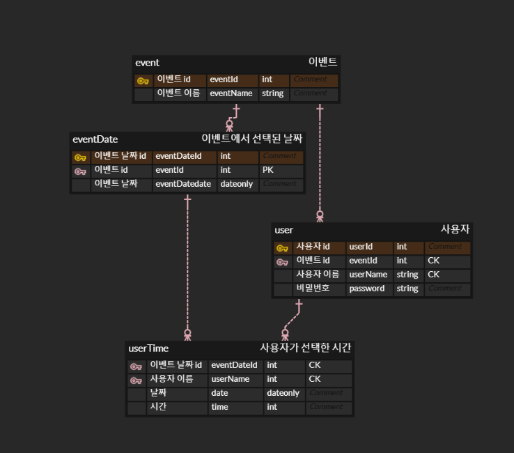
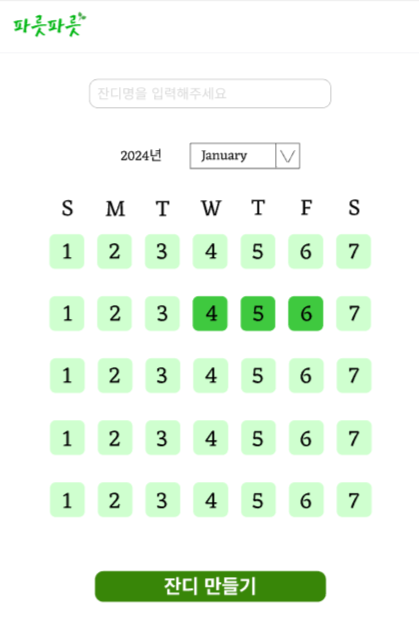
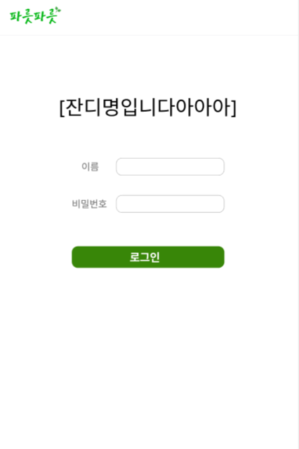
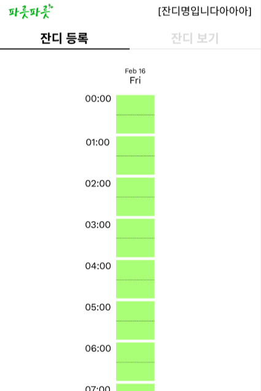
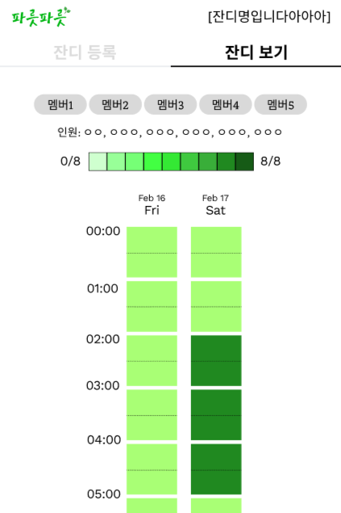

  
  <h3>모두가 가능한 최고의 시간을 찾아보세요!</h3>

  <video style="width: 100%;" controls>
    <source src="./misc/실행영상.mp4" type="video/mp4" />
  </video>

 

<h2>📄 목차</h2>
<ul>
  <li><a href="#-목차">📄 목차</a></li>
  <li><a href="#-프로젝트-개요">✍🏻 프로젝트 개요</a></li>
  <li><a href="#-기술-스택">🛠 기술 스택</a></li>
  <li><a href="#-erd">🗂 ERD</a></li>
  <li>
    <a href="#-사용-방법">🚀 사용 방법</a>
    <ul>
      <li><a href="#1-이벤트-생성">1. 이벤트 생성</a></li>
      <li><a href="#2-로그인-및-회원가입">2. 로그인 및 회원가입</a></li>
      <li><a href="#3-가능한-시간-등록-및-확인">3. 가능한 시간 등록 및 확인</a></li>
    </ul>
  </li>
  <li><a href="#-팀원-소개">👨‍👨‍👦‍👦 팀원 소개</a></li>
</ul>

 

## ✍🏻 프로젝트 개요

**"잔디"** 프로젝트는 when2meet을 벤치마킹하여 **팀원들이 모임 시간을 쉽게 정할 수 있도록** 도와주는 서비스입니다.

가장 많은 사람들이 가능한 시간을 깃허브의 '잔디' 형태로 표시하여 선호하는 모임 시간을 직관적으로 확인할 수 있습니다.

 

## 🛠 기술 스택

<table>
  <tr>
    <th>분야</th>
    <th>기술 스택</th>
  </tr>
  <tr>
    <td style="white-space: nowrap;"><b>프론트엔드</b></td>
    <td>
      
      
      
    </td>
  </tr>
  <tr>
    <td><b>백엔드</b></td>
    <td>
      
      
      
      
      
    </td>
  </tr>
  <tr>
    <td><b>코드 품질</b></td>
    <td>
      
      
    </td>
  </tr>
</table>

 

## 🗂 ERD

<a href="https://www.erdcloud.com/d/kPKoPRN5DfwFMEi4a" >👉 erd cloud에서 보기</a>

 

## 🚀 사용 방법

<table align="center">
  <tr>
    <td style="text-align: center;">
       
      <b>이벤트 생성</b>
    </td>
    <td style="text-align: center;">
       
      <b>로그인</b>
    </td>
    <td style="text-align: center;">
       
      <b>잔디등록</b>
    </td>
    <td style="text-align: center;">
       
      <b>잔디보기</b>
    </td>
  </tr>
</table>

### 1. 이벤트 생성

사용자가 이벤트를 생성할 수 있습니다.

1. **이벤트 이름 입력**: 간단한 모임 이름을 입력합니다.
2. **날짜 범위 설정**: 팀원들이 선택 가능한 날짜 범위를 설정합니다.

### 2. 로그인 및 회원가입

가능한 시간 등록을 위한 로그인 및 회원가입 기능을 제공합니다.

1. **회원가입**: 새로운 사용자는 간단한 회원가입 후 즉시 로그인이 가능합니다.
2. **로그인**: 기존 사용자는 이메일과 비밀번호를 통해 로그인할 수 있습니다.

### 3. 가능한 시간 등록 및 확인

사용자는 자신이 가능한 시간을 등록하고, 다른 팀원들의 가능한 시간을 확인할 수 있습니다.

- **가능 시간 등록**: 로그인 후 자신의 가능한 시간을 선택하여 등록할 수 있습니다.
- **등록된 시간 확인**: 팀원들의 전체 가능한 시간과 각각의 시간을 확인할 수 있습니다.

 

## 👨‍👨‍👦‍👦 팀원 소개

<table>
  <tr height="130px">
    <td align="center" width="130px">
      
    </td>
    <td align="center" width="130px">
      
    </td>
    <td align="center" width="130px">
      
    </td>
    <td align="center" width="130px">
      
    </td>
    <td align="center" width="130px">
      
    </td>
  </tr>
  <tr height="50px">
    <td align="center" width="130px"><a href="https://github.com/hayamaster">김주하</a></td>
    <td align="center" width="130px"><a href="https://github.com/andyhan-23">한재혁</a></td>
    <td align="center" width="130px"><a href="https://github.com/nuyeo">구연우</a></td>
    <td align="center" width="130px"><a href="https://github.com/xEzIxX">정예지</a></td>
    <td align="center" width="130px"><a>김현아</a></td>
  </tr>
</table>

 
